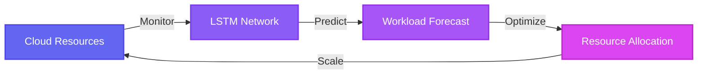

# ☁️ cloud-ai-compute

### 🚀 AI-Powered Cloud Computing Automation with PyTorch

---

### ⚡ Tech Stack

  
  
  

  
  
  
  

 

## 📖 About This Project

This project represents a **comprehensive approach** to intelligent cloud resource management, combining cutting-edge machine learning techniques with practical cloud infrastructure automation.

🎯 **Key Innovation**: Integration of LSTM networks for time-series workload prediction with intelligent resource allocation algorithms

 

---

## 👨‍💻 Project Credits

### ✨ **Created and Developed by SolvyrEryx** ✨

  

<table>
<tr>
<td align="center" width="50%">

### 🎨 Visual Design & Architecture

Crafted the elegant system architecture and intuitive component organization that makes this codebase accessible and maintainable

</td>
<td align="center" width="50%">

### 🔬 Research Direction

Established the theoretical foundation and research methodology, identifying the optimal approaches for cloud workload prediction

</td>
</tr>
<tr>
<td align="center" width="50%">

### 💻 Technical Implementation

Developed the complete PyTorch-based neural network models, training pipelines, and inference systems

</td>
<td align="center" width="50%">

### 🚀 Innovation

Pioneered the integration of LSTM networks for time-series workload prediction with intelligent resource allocation algorithms

</td>
</tr>
</table>

**SolvyrEryx's** vision and technical leadership were instrumental in every aspect of this project, from initial concept through final implementation.

 

---

## ✨ Features

<table>
<tr>
<td width="50%">

### 🧠 **Advanced Neural Networks**
- LSTM-based workload prediction models
- Time-series analysis capabilities
- Real-time pattern recognition

</td>
<td width="50%">

### 📊 **Intelligent Optimization**
- Dynamic resource allocation
- Cost-efficient scaling strategies
- Performance monitoring

</td>
</tr>
<tr>
<td width="50%">

### ⚡ **Real-Time Processing**
- Low-latency inference engine
- Instant decision-making
- Continuous learning pipeline

</td>
<td width="50%">

### 🔧 **Modular Design**
- Plug-and-play architecture
- Easy customization
- Extensible framework

</td>
</tr>
</table>

### 📈 **Comprehensive Training Pipeline**

 

---

## 🌐 Connect with Me

### Let's Innovate Together! 🤝

  

  
  
  

### 💬 I'm always interested in discussing:

🔹 Cloud Computing Architecture  
🔹 AI/ML Applications  
🔹 Infrastructure Automation  
🔹 Innovative Tech Solutions

**Feel free to reach out!** 📧

 

---

### 📊 GitHub Activity

<picture>
  <source media="(prefers-color-scheme: dark)" srcset="https://raw.githubusercontent.com/SolvyrEryx/SolvyrEryx/output/github-contribution-grid-snake-dark.svg">
  <source media="(prefers-color-scheme: light)" srcset="https://raw.githubusercontent.com/SolvyrEryx/SolvyrEryx/output/github-contribution-grid-snake.svg">
  
</picture>

 

  

### ⭐ Star this repo if you find it useful!

---

**Made with ❤️ by [SolvyrEryx](https://www.linkedin.com/in/rahulj7777/)**

